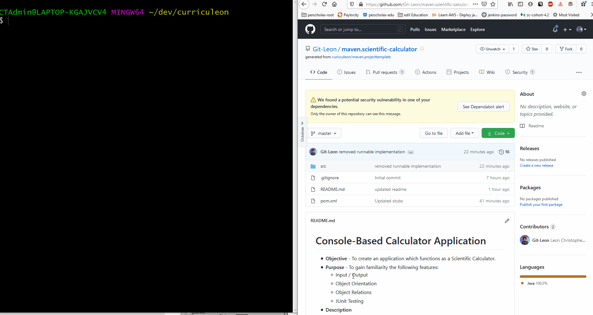

# Console-Based Calculator Application
* **Objective** - To create an application which functions as a Scientific Calculator.
* **Purpose** - To gain familiarity the following features:
    * Input / Output
    * Object Orientation
    * Object Relations
    * JUnit Testing
* **Description**
    * Create a console-based application which functions as a Scientific Calculator.
    * You are provided with several classes, and the method signatures necessary to achieve the desired application.    

### Demonstration
* Below is a brief demonstration of how this application works upon cloning it.
 

## Calculator Features

### Basic calculator Features
* `Double add(Double baseValue, Double valueToAddToBaseValue)`
    * return the _sum_ of two values
* `Double subtract(Double basValue, Double valueToSubtractFromBaseValue)`
    * return the _difference_ of two values
* `Double multiply(Double multiplicand, Double multiplier)`
    * return the _product_ of two values
* `Double divide(Double divisor, Double dividend)`
    * return the _quotient_ of two values
* `Double square(Double valueToBeSquared)`
    * return the _square_ of a specified value
* `Double power(Double baseValue, Double exponent)`
    * return `baseValue` raisied to the `exponent` power
* `Double inverse(Double valueToBeInverted)`
    * return `valueToBeInverted` raised to the negative one power
* `Double invertSign(Double valueToBeInverted)`
    * return `valueToBeInverted` multiplied by negative one.

### Display Features
* `String getDisplayValue()`
    * retrieve the current value presented on the display
* `void clearDisplayValue()`
    * clear the value presented on the display
* `void updateDisplayValue(String valueToBeUpdated)`
    * update the displayed value to the specified `valueToBeUpdated`
* `void switchDisplayModeToBinary()`
    * convert the displayed value to an expression in base two
* `void switchDisplayModeToOctal()`
    * convert the displayed value to an expression in base eight
* `void switchDisplayModeToDecimal()`
    * convert the displayed value to an expression in base ten
* `void switchDisplayModeToHexadecimal()`
    * convert the displayed value to an expression in base sixteen
* `void switchDisplayModeToDegrees()`
    * convert the displayed value to degrees
* `void switchDisplayModeToRadians()`    
    * convert the displayed value to radians
    
### Memory Features
* `void storeValue(Double valueToBeStored)`
    * mutates the `storedValue` field
* `Double getStoredValue()`
    * return the `storedValue` field
* `void addCurrentDisplayValueToStoredValue()`
    * mutates the `displayedValue` to the _sum_ of `displayedValue` and `storedValue`

### Trignometric Features
* `Double sine(Double valueToComputeSineOf)`
    * return the computed sine of `valueToComputeSineOf`
* `Double cosine(Double valueToComputeCosineOf)`
    * return the computed cosine of `valueToComputeCosineOf`
* `Double tangent(Double valueToComputeTangentOf)`
    * return the computed tangent of `valueToComputeTangentOf`
* `Double inverseSine(Double valueToComputeInverseSineOf)`
    * return the computed inverse-sine of `valueToComputeInverseSineOf`
* `Double inverseCosine(Double valueToComputeInverseCosineOf)`
    * return the computed inverse-cosine of `valueToComputeInverseCosineOf`
* `Double inverseCosine(Double valueToComputeInverseTangentOf)`
    * return the computed inverse-tangent of `valueToComputeInverseTangentOf`
    
### Logarithmic Features
* `Double log(Double valueToComputeLogOf)`
* `Double naturalLog(Double valueToComputeNaturalLogOf)`
* `Double inversNaturalLog(Double valueToComputeInverseNaturalLogOf)`

## How to Download

#### Part 1 - Forking the Project
* To _fork_ the project, click the `Fork` button located at the top right of the project.

#### Part 2 - Navigating to _forked_ Repository
* Navigate to your github profile to find the _newly forked repository_.
* Copy the URL of the project to the clipboard.

#### Part 3 - Cloning _forked_ repository
* Clone the repository from **your account** into the `~/dev` directory.
  * if you do not have a `~/dev` directory, make one by executing the following command:
    * `mkdir ~/dev`
  * navigate to the `~/dev` directory by executing the following command:
    * `cd ~/dev`
  * clone the project by executing the following command:
    * `git clone https://github.com/MYUSERNAME/NAMEOFPROJECT`

#### Part 4 - Check Build
* Ensure that the tests run upon opening the project.
    * You should see `Tests Failed: 99 of 99 tests`

## How to Submit

#### Part 1 -  _Pushing_ local changes to remote repository
* from a _terminal_ navigate to the root directory of the _cloned_ project.
* from the root directory of the project, execute the following commands:
    * add all changes
      * `git add .`
    * commit changes to be pushed
      * `git commit -m 'I have added changes'`
    * push changes to your repository
      * `git push -u origin master`

#### Part 2 - Submitting assignment
* from the browser, navigate to the _forked_ project from **your** github account.
* click the `Pull Requests` tab.
* select `New Pull Request`